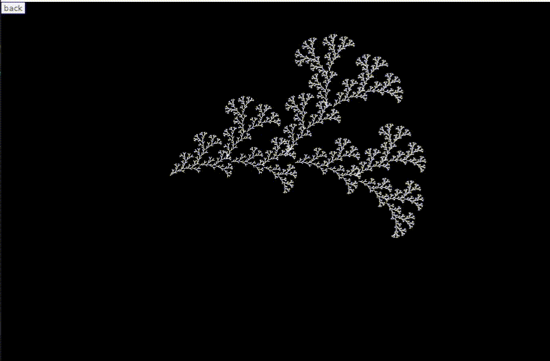
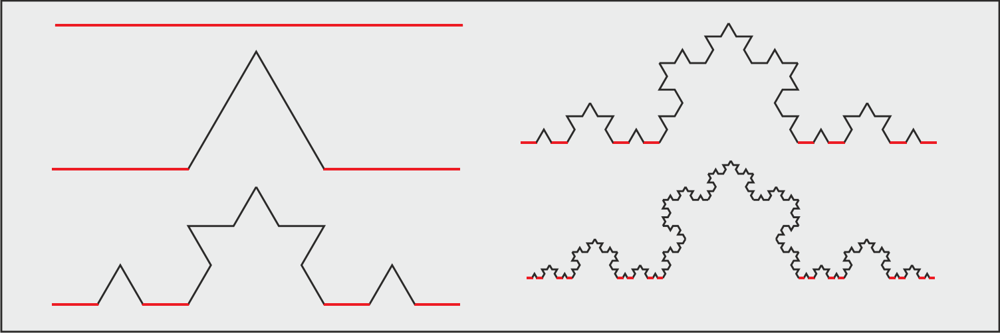
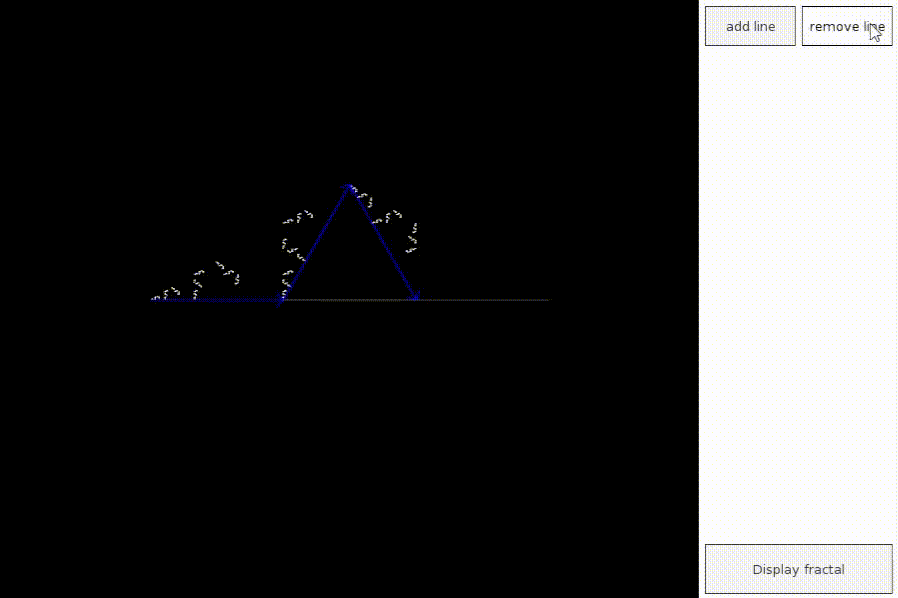

intuitively generate fractal geometry!

[Install Instructions](#install)

Fractal geometry can be created by subdiving a line into smaller lines using a pattern, and then applying that same pattern to each of the lines. This process can be repeated infinitly many times, and the results can be quite unexpected and beautiful. Fractal geometry can be magnified infinitley, and new details will still emerge.

This program allows you do define the patterns, and will generate the fractal for a pattern. 

have fun!